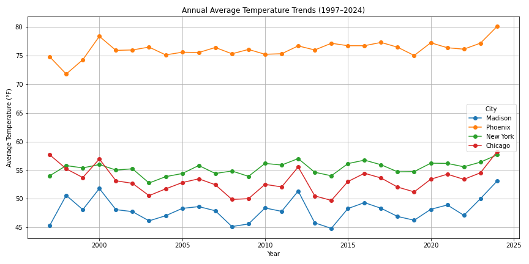
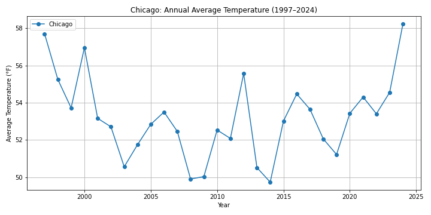
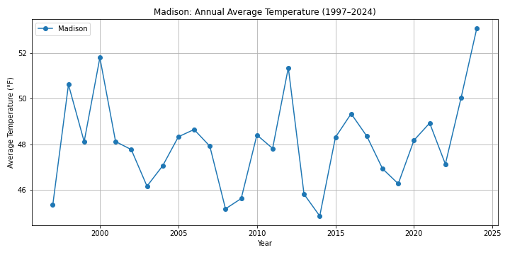
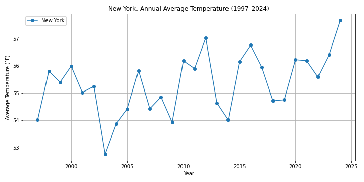
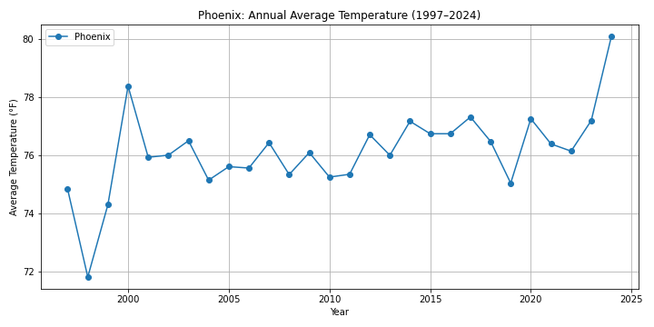
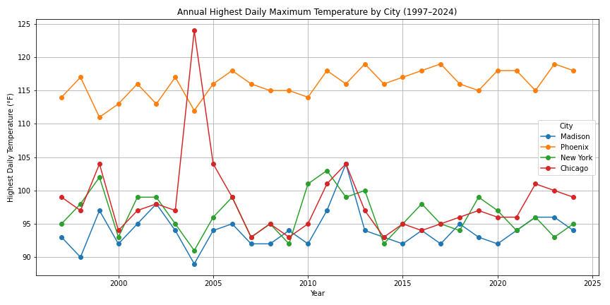
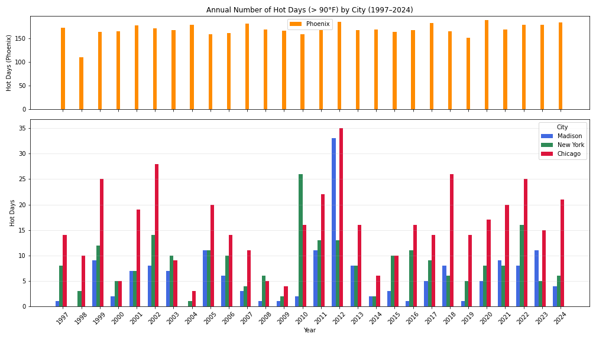

# Climate Warming: Long-Term Temperature Trend Analysis (1997–2024)

## Introduction

This report investigates whether climate warming is evident by analyzing long-term temperature data from four U.S. cities: Madison, Phoenix, New York, and Chicago. The analysis covers the years 1997 to 2024. I examine trends in average temperatures, annual maximum temperatures, and the number of hot days each year.

## Data and Methodology

I use daily temperature data from the NOAA National Centers for Environmental Information. For each city, and calculate:

* Annual average temperature using daily max and min values
* Annual highest recorded temperature
* Number of days with temperatures over 90°F

All results are shown through line and bar charts. Data cleaning and plotting were done using Python.

## Results and Visualizations

### Annual Average Temperatures

The following chart shows the overall trend in annual average temperatures across all four cities:

*Phoenix remains significantly warmer throughout the period, while all cities show a gradual upward trend.*

Individual city trends are shown below:

* **Chicago:**

  
  *Chicago shows a fluctuating trend with a notable increase after 2015.*

* **Madison:**

  
  *Madison displays a variable pattern but shows a sharp rise in the last few years.*

* **New York:**

  
  *New York exhibits a relatively smooth upward trend across the entire period.*

* **Phoenix:**

  
  *Phoenix has consistently high average temperatures, with recent years showing a slight increase.*

### 2. Annual Maximum Temperatures

This plot shows the highest recorded daily temperature in each year for each city:

*Extreme spikes appear occasionally, especially in Chicago around 2004, and Phoenix maintains a high baseline.*

### 3. Number of Hot Days (> 90°F)

The chart below displays the number of days above 90°F for each city annually. Phoenix is shown separately due to its much higher values.

*Phoenix consistently has over 150 hot days per year. Other cities show fewer, but increasing, hot days over time.*

## Discussion

Phoenix shows a strong urban heat effect, with consistently high temperatures and a large number of hot days. Chicago and Madison show more variation but also a rising trend. New York displays a smoother increase. The data supports the presence of climate warming trends, though local conditions influence the magnitude.

## Conclusion

This analysis shows evidence of rising temperatures in all four cities. Climate warming is evident in both average conditions and extreme heat events. The results support concerns over long-term warming and its regional variability.

## Limitations

This study uses publicly available daily temperature data, which may include missing values or inconsistent reporting across stations and years. Only four cities were analyzed, which limits generalizability. Other climate indicators (e.g., precipitation, humidity) were not considered.

## Author

**Klina123**
GitHub: [https://github.com/Klina123](https://github.com/Klina123)
